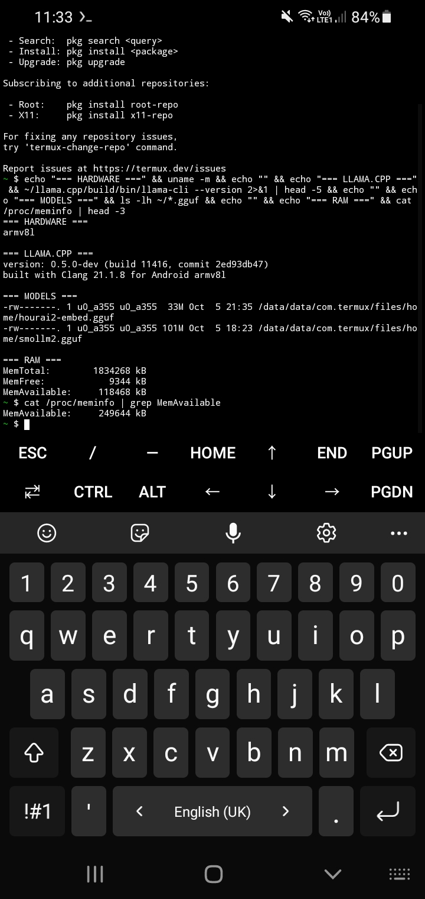

# Atrric

**Sovereign RAG infrastructure for Malaysian market intelligence.**

[](https://www.python.org/)
[](https://fastapi.tiangolo.com/)
[](https://www.trychroma.com/)
[](LICENSE)
[]()

---

## Table of Contents

- [What is Atrric](#what-is-atrric)
- [The Problem](#the-problem)
- [The Approach](#the-approach)
- [Use Cases](#use-cases)
- [Architecture](#architecture)
- [Tech Stack](#tech-stack)
- [Project Status](#project-status)
- [Quickstart](#quickstart)
- [Roadmap](#roadmap)
- [Non-Goals](#non-goals)
- [Contributing](#contributing)
- [License](#license)

---

## What is Atrric

Atrric is a retrieval-augmented generation (RAG) engine built for analyzing Gen Z behavior and local market dynamics in Malaysia. It is designed for data sovereignty, offline-capable operation, and flexible deployment.

The system ingests real conversation data, builds a semantic index, and answers business queries with source attribution and reasoning transparency.

---

## The Problem

Consumer intelligence in Malaysia has three structural weaknesses:

1. **Survey bias.** Most insights come from panels that self-select, skew urban and English-speaking, and miss how Gen Z actually talks and thinks.
2. **Data sovereignty gap.** Existing AI analytics tools route data to foreign servers. Enterprises with sensitive data have no compliant option.
3. **No real-time signal.** Policy shifts, economic pressure, and platform migration happen weekly. Quarterly reports cannot keep up.

---

## The Approach

Atrric addresses these by design:

- **Real conversation data.** Ingests qualitative data from real discussions, not survey responses.
- **Flexible LLM backend.** Choose between local inference (full sovereignty) or API providers (lower hardware requirements).
- **Multilingual by default.** Handles Malay, English, and Manglish code-switching natively.
- **Reasoning transparency.** Every answer includes source attribution and confidence scoring.
- **Bring your own model.** No vendor lock-in. Configure any compatible LLM.

---

## Use Cases

- Market research on Gen Z consumer behavior in Malaysia
- Enterprise deployment requiring local data sovereignty
- Academic research on regional language models and RAG systems
- Rapid prototyping of domain-specific RAG pipelines

---

## Architecture

```

User Query -> Guardrails -> Embedding -> Retrieval -> Context Assembly -> Generation -> Response

```

### Design Principles

- **Backend-agnostic.** Switch between local inference and hosted APIs via configuration. No code changes required.
- **Two-layer chunking.** Child chunks for precise retrieval, parent chunks for full context. Prevents the classic RAG trade-off between precision and coherence.
- **Rich metadata.** Every chunk carries source file, hash, timestamp, chunk type, and parent index for traceability.
- **Offline-capable.** Runs entirely on local hardware when configured for local inference. No outbound network calls.
- **Modular.** Ingestion, retrieval, generation, and API are separate components.

---

## Tech Stack

| Layer | Technology |
| :--- | :--- |
| Vector Database | ChromaDB 0.5+ |
| LLM Backend | Pluggable: local inference (e.g. Ollama) or API provider |
| Embedding Backend | Pluggable: local or API |
| API Framework | FastAPI 0.110+ |
| Language | Python 3.10+ |
| NLP | NLTK, langdetect |
| Testing | pytest |
| Containerization | Docker, docker-compose |

---

## Project Status

**Current phase:** Early development.

The architecture is complete. Core components are implemented. End-to-end verification is in progress.

| Component | Status |
| :--- | :--- |
| Ingestion pipeline | Implemented |
| Parent-child chunking | Implemented |
| ChromaDB retrieval | Implemented |
| Guardrails (6-layer) | Implemented |
| FastAPI endpoints | Implemented |
| Flexible backend abstraction | In progress |
| Evaluation framework | In progress |
| Agent | Experimental |
| Data extraction | In progress |
| Frontend | Planned |

### Known Limitations

- End-to-end pipeline has not yet been verified on production-scale data.
- Flexible backend abstraction is planned but not yet implemented. Current version targets local inference only.
- Evaluation metrics are defined but not yet benchmarked against ground truth.
- Data extraction requires an Xpoz API key for social media sources.
- Test coverage is minimal.

Limitations are published openly so contributors and users can calibrate expectations accurately.

___

### Verified Deployments

The Atrric RAG pipeline components have been verified on minimum hardware:

| Environment | Hardware | Model | Status |
| :--- | :--- | :--- | :--- |
| Android / Termux | Samsung A10s, 2GB RAM, ARMv7 (32-bit) | SmolLM2 135M + hourai2-50m embedding | Proof of concept |

**llama.cpp compiled from source for ARMv7:**



**Embedding and vector search working on-device:**


**Notes on the phone deployment:**

- `llama.cpp` was compiled from source (Clang 21.1.8, ARMv7 target) due to lack of official ARMv7 binaries.
- Embedding runs at 128 dimensions via `hourai2-50m-embedding`.
- Generation runs at ~2.5 tokens/second via SmolLM2 135M on a MediaTek Helio P22 CPU.
- Output quality is limited by the 135M parameter model. The pipeline architecture itself is sound and works end-to-end.
- Production deployments should target 1B–8B parameter models on machines with 8GB+ RAM.

This deployment confirms the pipeline can operate on constrained hardware without external API calls, in line with Atrric's data-sovereignty goals.


---

## Quickstart

### Prerequisites

- Python 3.10 or higher
- Git
- One LLM backend: either a local runtime (e.g. Ollama) or an API provider key

### Setup

```bash
# 1. Clone the repository
git clone https://github.com/hunterknowledge-ux/Atrric.git
cd Atrric

# 2. Install dependencies
pip install -r requirements.txt

# 3. Configure environment
cp .env.example .env
# Edit .env: choose backend and provide credentials if using an API

# 4. Build the index
python build_rag.py

# 5. Run a query
python query_rag.py "how does Gen Z view AI in Malaysia"

# 6. Start the API server
python api.py
# Server: http://localhost:8000
# API docs: http://localhost:8000/docs
```

Configuration

All configuration lives in config.py. Environment-specific values go in .env. Do not commit .env.

Backend selection:

Atrric supports two LLM backends. Choose one in config.py or .env:

Backend Use Case Requirement
local Full data sovereignty, offline operation Local LLM runtime (e.g. Ollama)
api Lower hardware requirements, higher throughput API provider key

Model names are user-provided. Atrric does not bundle or assume any specific model.

---

Roadmap

Phase Target Status
1 Core RAG pipeline In progress
2 Evaluation framework In progress
3 Data extraction pipeline In progress
4 Agentic automation In progress
5 Dashboard Planned
6 Production deployment Planned
7 GraphRAG integration Planned
8 Hybrid search and reranking Planned

---

Non-Goals

Atrric is not:

· A hosted product. You deploy and run it yourself, on your own infrastructure.
· An LLM provider. Atrric orchestrates models, local or API-based, but does not train or host its own.
· A general-purpose chatbot. It is purpose-built for structured market intelligence, not open-ended chat.
· A drop-in replacement for anything. It is a focused tool, not a platform.

---

Contributing

This project is in early development. Contributions, feedback, and bug reports are welcome. Please open an issue before submitting large changes.

---

License

MIT License. See LICENSE for details.

```